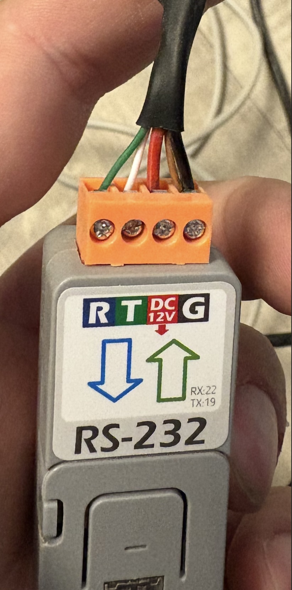

# Pylontech Battery Monitoring via WiFi

This project allows you to control and monitor Pylontech US2000B, US2000C and US3000C batteries via console port over WiFi.
It it's a great starting point to integrate battery with your home automation.

**I ACCEPT NO RESPONSIBILTY FOR ANY DAMAGE CAUSED, PROCEED AT YOUR OWN RISK**

# Features:
  * Low cost (around 17$ in total).
  * Adds WiFi capability to your Pylontech US2000B/C or US3000C battery.
  * Device exposes web interface that allows to:
    * send console commands and read response over WiFi (no PC needed)
    * battery information can be retrevied also in JSON format for easy parsing
  * MQTT support:
    * device pushes basic battery data like SOC, temperature, state, etc to selected MQTT server
  * Easy to modify code using Arduino IDE and flash new firmware over WiFi (no need to disconnect from the battery).

See the project in action on [Youtube](https://youtu.be/7VyQjKU3MsU): 

# Parts needed and schematics:
  * [M5 Atom lite](https://shop.m5stack.com/products/atom-lite-esp32-development-kit).
  * [ATOMIC RS232 Base W/O Atom lite](https://shop.m5stack.com/products/atomic-rs232-base-w-o-atom-lite).
  * US2000B: Cable with RJ10 connector (some RJ10 cables have only two wires, make sure to buy one that has all four wires present).
  * US2000C: Cable with RJ45 connector (see below for more details).

# US2000C/US3000C notes:
This battery uses RJ45 cable instead of RJ10. Schematics is the same only plug differs:

    
| RJ45 | ATOMIC RS232 PIN|
|------|--------------|
|PIN 3 (white-green)|     T        |
|PIN 6 (green)|     R        |
|PIN 8 (brown)|     G        |

# How to get going:
  * Get Wemos D1 mini
  * Install arduino IDE and M5Atom libraries as [described here](https://github.com/m5stack/M5Atom)
  * Open [PylontechMonitoring.ino](PylontechMonitoring.ino) in arduino IDE
  * Make sure to copy content of [libraries subdirectory](libraries) to [libraries of your Arduino IDE](https://forum.arduino.cc/index.php?topic=88380.0).
  * Specify your WiFi login and password at the top of the file (line 12-13)
  * If you want MQTT support, uncomment line 35 and fill details in lines 47-52
  * Upload project to your device
  * Install M5 Atom to Atomic 232
  * Connect cable to Atomic 232)
  * Connect RJ10/RJ45 to the CONSOLE port of the Pylontech US2000 battery. If you have multiple batteries - connect to the master one.
  * Connect to power
  * Find what IP address was assigned to your Wemos by your router and open it in the web-browser
  * You should be able now to connunicate with the battery via WiFi
